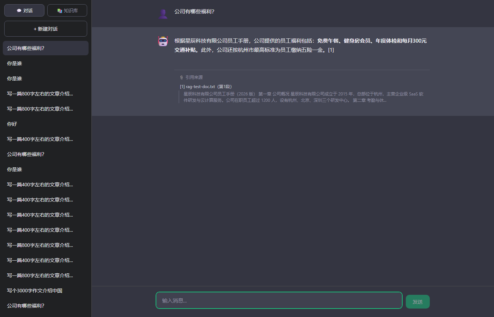

# 企业知识库问答智能体（RAG Chatbot）

Spring Boot + LangChain4j + Elasticsearch + Vue3 构建的企业知识库问答系统，支持文档入库、混合检索、引用溯源、多会话记忆隔离和流式输出。

## 效果预览



## 功能特性

- **混合检索**：kNN 向量检索（BGE-M3 1024 维）+ BM25 全文检索（cjk 中文分词），自研 RRF（Reciprocal Rank Fusion）加权融合，配合查询长度归一化门控与相对分数截断，兼顾语义召回与词项精度
- **引用溯源**：AI 回答标注 `[n]` 引用编号，前端渲染「📎 引用来源」块（文档名、段落号、原文摘录），引用 JSON 持久化到 MySQL，历史会话可追溯
- **文档入库**：上传 → 本地落盘 → Apache Tika 解析（PDF/Word/PPT/TXT/MD）→ 字符级切分（800 字/块，100 重叠）→ BGE-M3 向量化（32 条分批 + 重试）→ Elasticsearch 索引，全程状态可查
- **多会话记忆隔离**：Redis 按 sessionId 独立存储上下文（最近 20 条，7 天 TTL），MySQL 持久化全量历史，Redis 失效自动从 MySQL 恢复
- **流式输出**：SSE 逐 token 推送（citations → token → done），流式期间纯文本渲染、完成后 Markdown 渲染（DOMPurify 消毒）
- **知识库管理**：前端上传/列表/删除，删除时同步清理磁盘文件与 ES 向量

## 技术栈

| 层 | 技术 | 版本 |
|---|---|---|
| 框架 | Spring Boot | 4.1.0 |
| AI 框架 | LangChain4j | 1.0.0-beta2 |
| LLM | DeepSeek（OpenAI 兼容） | deepseek-chat |
| Embedding | 硅基流动 BGE-M3 | 1024 维 |
| 向量库 | Elasticsearch | 8.15.3（Docker） |
| 文档解析 | Apache Tika | 3.0.0 |
| 缓存 / 持久化 | Redis / MySQL (JPA) | - |
| 前端 | Vue 3 + Vite | 5.x |

## 架构

```
文档入库链路:
  upload → 磁盘落盘 → Tika 解析 → 切分(800/100) → BGE-M3 向量化(分批32)
         → ES 索引(vector 1024维 + text cjk + flattened metadata)
         → MySQL 登记元数据(status: READY/FAILED)

检索问答链路:
  POST /api/chat/stream
    → BM25 召回 (match on text, 查询长度归一化门控)
    → kNN 召回 (dense_vector, minScore 0.35, top1 相对截断 80%)
    → RRF 加权融合 (k=60, 按块文本去重, 跨路分数累加) → top-5
    → 组装 SystemMessage(人设 + 参考资料) → DeepSeek 流式生成
    → SSE: citations 事件(引用) → token 流 → done
    → AI 回复 + 引用 JSON 落 MySQL, 上下文写 Redis
```

## 快速启动

### 前置条件

- JDK 17+、Node.js 18+
- MySQL 8.0+（root / 123456），创建数据库 `ai_chat`
- Redis（本地 6379，无密码）
- Docker（运行 Elasticsearch）

### 1. 启动 Elasticsearch

```bash
# Windows WSL2 首次需要：
wsl -d docker-desktop sysctl -w vm.max_map_count=262144

docker run -d --name es-kb -p 9200:9200 -p 9300:9300 \
  -e "discovery.type=single-node" -e "xpack.security.enabled=false" \
  -e "ES_JAVA_OPTS=-Xms512m -Xmx512m" -v esdata:/usr/share/elasticsearch/data \
  docker.elastic.co/elasticsearch/elasticsearch:8.15.3
```

后端启动时自动创建索引 `kb_vectors`（1024 维 dense_vector + cjk text + flattened metadata）。

### 2. 启动后端

```bash
# Linux / macOS
export DEEPSEEK_API_KEY=sk-xxx
export SILICONFLOW_API_KEY=sk-xxx

# Windows PowerShell
$env:DEEPSEEK_API_KEY="sk-xxx"
$env:SILICONFLOW_API_KEY="sk-xxx"

./mvnw spring-boot:run
```

后端运行在 http://localhost:8080

### 3. 启动前端

```bash
cd frontend
npm install
npm run dev
```

前端运行在 http://localhost:5173，API 自动代理到 8080。

### 4. 使用

1. 打开 http://localhost:5173，点击侧栏「📚 知识库」上传文档（`kb-docs/` 目录内有 4 份示例文档）
2. 切回「💬 对话」新建会话，提问知识库内容（如「年假有多少天」）
3. AI 回答下方展示引用来源块

## API

| 方法 | 路径 | 说明 |
|------|------|------|
| POST | `/api/sessions` | 创建会话 |
| GET | `/api/sessions` | 会话列表 |
| DELETE | `/api/sessions/{id}` | 删除会话 |
| GET | `/api/sessions/{id}/messages` | 历史消息（含引用） |
| POST | `/api/chat/stream` | 流式问答（SSE） |
| POST | `/api/documents/upload` | 上传知识库文档 |
| GET | `/api/documents` | 文档列表 |
| DELETE | `/api/documents/{id}` | 删除文档（同步删向量） |

## 检索策略设计说明

1. **为什么 BM25 是 RAG 触发门**：BGE-M3 对短中文查询的余弦基线很高（实测无关查询 0.456 vs 相关 0.476，绝对阈值无法区分），而 BM25 词项重叠区分度极好（闲聊零命中、相关查询 0.4+）。BM25 零命中则不触发 RAG，走纯聊天。
2. **查询长度归一化门控**：语料扩充后长查询靠单字重叠产生噪声分（「写文章介绍英国」1.43 分 vs 相关查询 1.87），按 `score / 查询字符数` 归一化后无关 0.09 vs 相关 0.31+，阈值 0.15 干净分离。
3. **相对分数截断**：kNN 路只保留 top1 分数 80% 以上的块（实测相关块 0.692 vs 噪声 0.40~0.45），BM25 路保留 top1 30% 以上（2.43 vs 0.52），避免引用列表被噪声块占满。
4. **RRF 按块文本去重**：同块被两路命中时每路只取最高 rank、跨路分数累加——既奖励双路共识，又防止重复上传的同内容块虚高。

## 项目结构

```
demo/
├── pom.xml
├── src/main/java/com/example/demo/
│   ├── config/      # AI 模型/记忆 Bean、ES 客户端与索引初始化、CORS、SSE 编码
│   ├── controller/  # 聊天(SSE)、会话、知识库文档 API
│   ├── dto/         # ChatRequest、CitationVO、DocumentVO、MessageVO、SessionVO
│   ├── entity/      # ChatSession、ChatMessage(含 citations)、KnowledgeDocument
│   ├── repository/  # JPA 仓库
│   └── service/     # ChatService(RAG 注入)、RagRetriever(混合检索)、
│                    # KnowledgeDocumentService(入库链路)、SessionService
├── src/main/resources/application.properties
├── kb-docs/         # 示例知识库文档（员工手册/CRM 手册/差旅制度/入职指南/FAQ）
└── frontend/        # Vue3 前端（SSE 客户端、聊天窗口、知识库面板、引用块）
```
